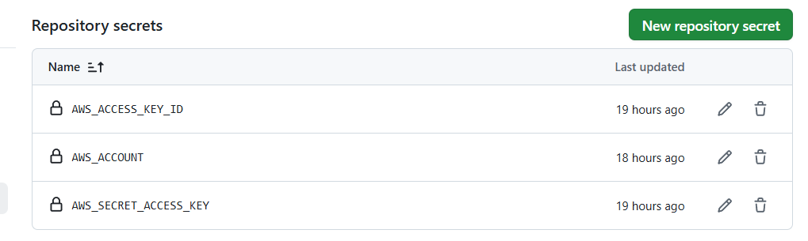
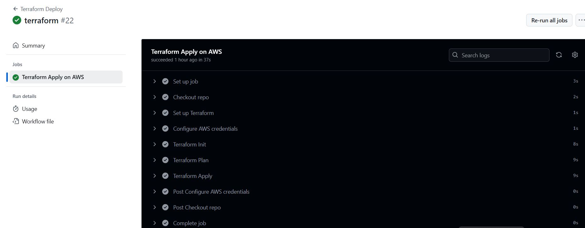
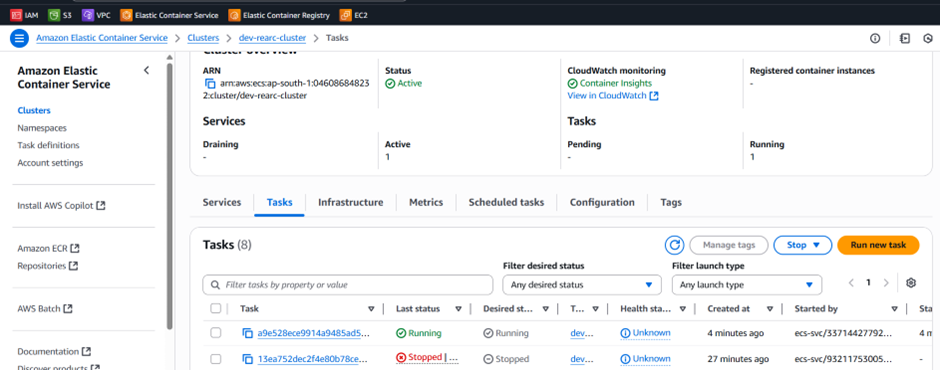
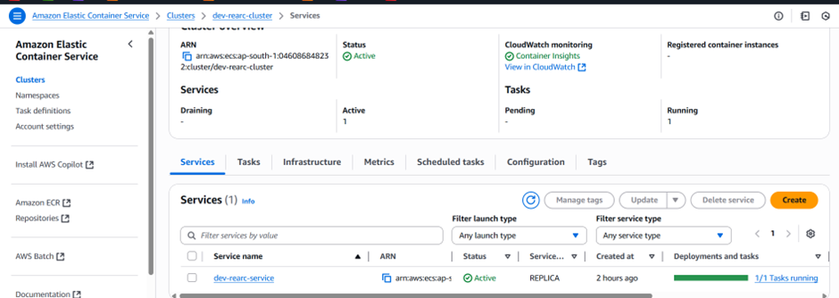
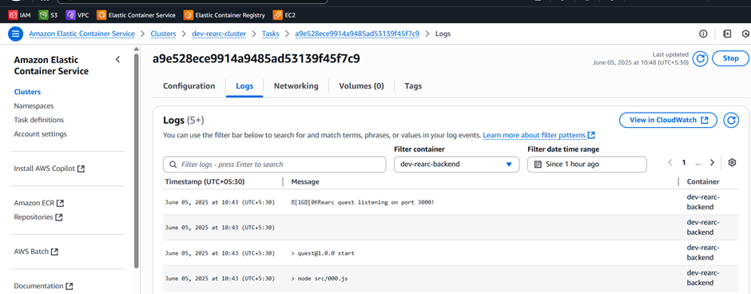
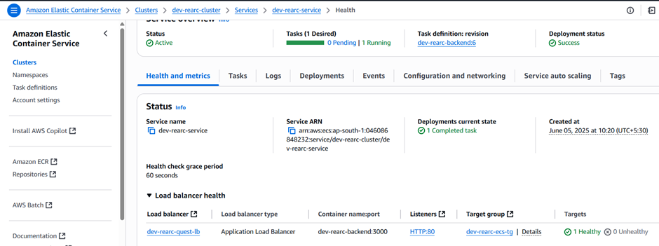
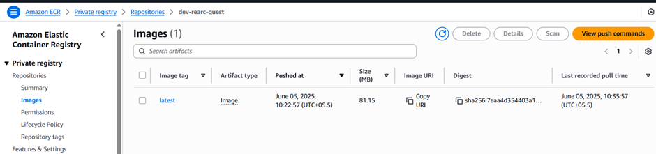
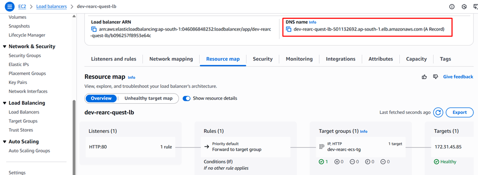
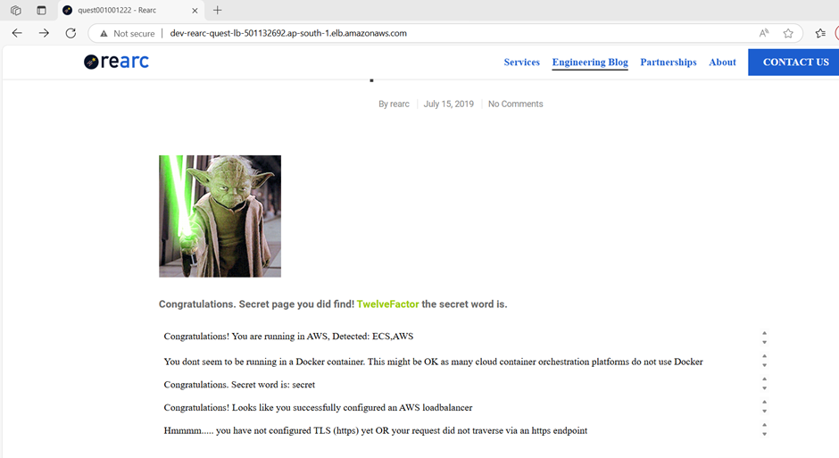

# 🚀 Rearc Case Study

This case study demonstrates how to deploy a containerized application on AWS using Infrastructure as Code (IaC) and CI/CD pipelines.

---

## 🔧 Technologies Used

- **Cloud Provider**: AWS  
- **Infrastructure as Code**: Terraform  
- **CI/CD**: GitHub Actions  
- **Containerization**: Docker  
- **Monitoring**: AWS CloudWatch  

---

## 📦 AWS Resources Created via Terraform

The following AWS components are provisioned automatically:

1. **Elastic Container Service (ECS)** – to run container workloads  
2. **Application Load Balancer (ALB)** – to expose ECS services publicly via HTTPS  
3. **Security Groups** – to manage secure network access  
4. **IAM Roles & Policies** – for secure interaction between services  
5. **Elastic Container Registry (ECR)** – to store Docker images  
6. **AWS CloudWatch** – to monitor application logs  
7. **VPC** – using default AWS VPC for networking  
8. **AWS ACM** – (optional) for HTTPS via TLS/SSL certificates  

---

## 🛠️ Project Structure

├── .github/workflows/
│ ├── deployment.yml # CI/CD: build, push to ECR, ECS update
│ ├── terraform.yml # Terraform CI/CD pipeline
│ └── destroy.yml # (Optional) Destroy AWS resources manually
├── quest/
│ ├── bin/
│ ├── src/
│ ├── Dockerfile
│ └── package.json
├── terraform/
│ ├── ecs.tf # ECS cluster, task, and service
│ ├── lb.tf # Load Balancer, listener, and target group
| | ---------
│ ├── variables.tf # Input variables
│ └── outputs.tf # Outputs like ALB DNS
└── README.md # This file

---

## ⚙️ CI/CD Workflows

### ✅ Setup Required Secrets in GitHub

Add the following GitHub repository secrets for workflows to function:

- `AWS_ACCESS_KEY_ID`  
- `AWS_SECRET_ACCESS_KEY`  
- `AWS_ACCOUNT`  

---

### 📌 `terraform.yml` Workflow

- Automatically plans and applies Terraform code on changes to the `/terraform` directory  
- Can be manually triggered from GitHub Actions tab 

Below are some screenshot for AWS resources:

### 🚀 `deployment.yml` Workflow

- Builds Docker image from the `/quest` directory  
- Pushes the image to Amazon ECR  
- Updates ECS service with the new image version  

---

## 🌐 Public Access

The application is publicly accessible via the Application Load Balancer:http://dev-rearc-quest-lb-501132692.ap-south-1.elb.amazonaws.com/

Once TLS is enabled, it will be accessible via `https://dev-rearc-quest-lb-501132692.ap-south-1.elb.amazonaws.com/` (or your configured domain).

---

## 📌 Notes

- Application listens on port **3000**
- ALB performs health checks on the `/` path of the ECS service
- Terraform handles infrastructure provisioning; GitHub Actions handles app deployment

---

## ✅ Next Steps / Improvements

- Switch to a custom VPC for better isolation  
- Integrate HTTPS using **AWS ACM + Route 53**  
- Add auto-scaling for ECS tasks  
- Setup detailed monitoring and alarms using CloudWatch  

---

